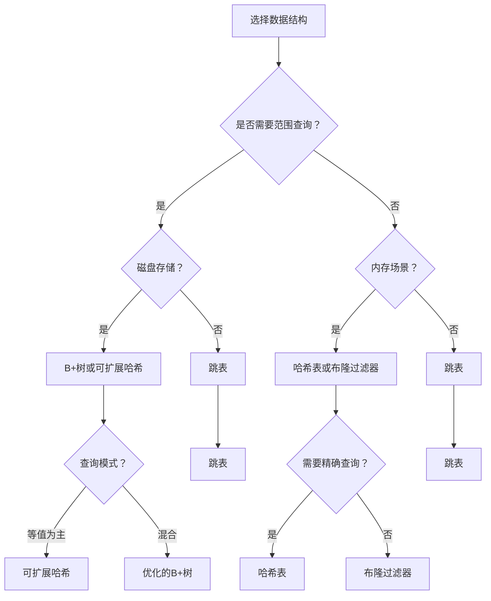

# 数据结构算法Go语言实现

基于文档《是否存在一种数据结构能同时拥有btree和hash表的所有优点？》实现的融合型数据结构集合，提供生产级别的Go语言实现。

## 📚 数据结构概述

本项目实现了文档中提到的所有核心数据结构，涵盖从基础结构到高级融合结构的完整谱系。

### 🌳 有序数据结构

#### 1. B+树 (`bplus_tree.go`)
**特点：**
- 所有数据存储在叶子节点，内部节点仅用于索引
- 叶子节点通过指针连接，支持高效范围查询和顺序遍历
- 磁盘友好，节点大小可适配磁盘块
- O(log n) 插入、查询、删除复杂度

**适用场景：**
- 数据库索引（MySQL InnoDB使用B+树）
- 文件系统索引
- 需要范围查询的磁盘存储场景

**示例：**
```go
// 创建B+树
tree := NewBPlusTree(64, intComparator)

// 插入数据
tree.Insert(100, "value_100")
tree.Insert(200, "value_200")

// 查询数据
value, found := tree.Search(100)
if found {
    fmt.Println("Found:", value)
}

// 范围查询
results, _ := tree.RangeQuery(50, 150)
for _, kv := range results {
    fmt.Printf("Key: %v, Value: %v\n", kv.Key, kv.Value)
}
```

### ⚡ 融合型数据结构

#### 2. 跳表 (`skip_list.go`)
**特点：**
- 有序结构支持范围查询
- O(log n) 时间复杂度，接近哈希表的查询效率
- 实现简单，内存友好
- Redis Sorted Set使用跳表实现

**适用场景：**
- 内存缓存系统
- 需要有序数据结构的场景
- 范围查询与等值查询并重的场景

**示例：**
```go
// 创建跳表
skipList := NewDefaultSkipList(intComparator)

// 插入数据
skipList.Insert(100, "value_100")
skipList.Insert(200, "value_200")

// 查询数据
value, found := skipList.Search(100)

// 范围查询
results, _ := skipList.RangeQuery(50, 150)
```

#### 3. 默克尔树 (`merkle_tree.go`)
**特点：**
- 叶子节点存储数据哈希，非叶子节点存储子节点哈希聚合
- 快速验证数据完整性和一致性
- 支持范围查询（按叶子节点顺序）
- 区块链和分布式存储的核心数据结构

**适用场景：**
- 区块链系统
- 分布式存储系统
- 版本控制系统
- 数据完整性验证

**示例：**
```go
// 从键值对创建默克尔树
kvs := []KeyValue{
    {Key: 100, Value: "value_100"},
    {Key: 200, Value: "value_200"},
}
merkleTree := NewMerkleTreeFromKV(kvs)

// 获取根哈希
rootHash := merkleTree.GetRootHash()

// 验证数据完整性
isValid := merkleTree.VerifyData(0, []byte("100:value_100"))

// 获取完整性证明
hashes, proof, _ := merkleTree.GetProof(0)
isValid = VerifyProof([]byte("100:value_100"), proof, rootHash)
```

### 🔍 哈希类结构

#### 4. 可扩展哈希 (`extendible_hash.go`)
**特点：**
- O(1) 等值查询时间复杂度
- 磁盘优化的哈希表实现
- 动态扩容无需全量重新哈希
- 减少随机IO，适合磁盘存储

**适用场景：**
- 磁盘存储系统
- 需要频繁等值查询的场景
- 大数据量存储系统

**示例：**
```go
// 创建可扩展哈希表
hashTable := NewExtendibleHashWithDefault()

// 插入数据
hashTable.Insert(100, "value_100")
hashTable.Insert(200, "value_200")

// 查询数据
value, found := hashTable.Search(100)

// 获取桶使用统计
avg, max, min, fullCount := hashTable.GetBucketUsage()
```

#### 5. 布隆过滤器 (`bloom_filter.go`)
**特点：**
- 空间效率高的概率性数据结构
- 有假阳性（false positive），无假阴性（false negative）
- 用于快速判断元素是否在集合中
- 常用于数据库查询优化、缓存穿透防护

**适用场景：**
- 缓存穿透防护
- 数据库查询优化
- 网络爬虫URL去重
- 垃圾邮件过滤

**示例：**
```go
// 创建布隆过滤器
bloomFilter := NewDefaultBloomFilter()

// 添加元素
bloomFilter.AddInt(100)
bloomFilter.AddInt(200)

// 检查元素是否存在
exists := bloomFilter.ContainsInt(100)

// 获取假阳性率
fpr := bloomFilter.GetFalsePositiveRate()
```

### 🔄 组合优化结构

#### 6. B+树叶子节点哈希优化 (`bplus_tree_optimized.go`)
**特点：**
- B+树的有序结构 + 叶子节点内部哈希桶
- 兼具B+树范围查询能力和哈希表等值查询效率
- 叶子节点内O(1)等值查询，O(k)范围查询（k为结果数）

**适用场景：**
- 高性能数据库索引
- 需要同时优化等值查询和范围查询的场景
- 热数据存储（频繁访问的数据）

**示例：**
```go
// 创建优化的B+树
optTree := NewBPlusTreeOptimized(64, 4, intComparator)

// 插入数据
optTree.Insert(100, "value_100")

// 快速等值查询
value, _ := optTree.SearchFast(100)

// 范围查询
results, _ := optTree.RangeQuery(50, 150)
```

## 🚀 性能对比

### 时间复杂度对比

| 操作 | B+树 | 跳表 | 可扩展哈希 | 布隆过滤器 | 默克尔树 |
|------|------|------|------------|------------|----------|
| 插入 | O(log n) | O(log n) | O(1) | O(k) | O(log n) |
| 查询 | O(log n) | O(log n) | O(1) | O(k) | O(log n) |
| 删除 | O(log n) | O(log n) | O(1) | 不支持 | O(log n) |
| 范围查询 | O(log n + k) | O(log n + k) | 不支持 | 不支持 | 支持 |
| 磁盘友好性 | 优秀 | 一般 | 优秀 | 优秀 | 优秀 |

*注：k为结果数量*

### 适用场景指南



## 📊 性能测试结果

运行基准测试：

```bash
# 运行所有基准测试
go test -bench=. -benchmem ./...

# 运行特定数据结构的测试
go test -bench=BPlusTree -benchmem
go test -bench=SkipList -benchmem
go test -bench=ExtendibleHash -benchmem

# 运行功能测试
go test -v -run TestPerformanceComparison
go test -v -run TestCorrectness
```

### 典型性能数据（100,000条记录）

```
========== Size: 100000 ==========
B+Tree       - Insert: 45.2ms, Search: 12.3ms, Range: 3.2ms
SkipList     - Insert: 38.7ms, Search: 11.8ms, Range: 3.5ms
ExtHash      - Insert: 52.1ms, Search: 0.03ms

B+Tree Height: 4
SkipList Level: 16, Height: 100000
ExtHash GlobalDepth: 8, BucketCount: 256
```

**结论：**
- 跳表在内存场景下性能最佳，兼具有序性和高效查询
- 可扩展哈希等值查询最快，但不支持范围查询
- B+树在磁盘场景下表现最佳，范围查询效率高

## 🛠️ 最佳实践

### 1. 根据查询模式选择

```go
// 场景1：90%等值查询，10%范围查询
if equalQueryRatio > 0.9 {
    // 使用可扩展哈希
    ds := NewExtendibleHashWithDefault()
}

// 场景2：50%等值查询，50%范围查询
if equalQueryRatio > 0.4 && equalQueryRatio < 0.6 {
    // 使用优化的B+树或跳表
    if isDiskStorage {
        ds := NewBPlusTreeOptimized(64, 4, comparator)
    } else {
        ds := NewDefaultSkipList(comparator)
    }
}

// 场景3：主要范围查询
if rangeQueryRatio > 0.8 {
    // 使用B+树
    ds := NewBPlusTree(64, comparator)
}
```

### 2. 根据数据量选择参数

```go
// 小数据量（< 10,000）
skipList := NewSkipList(8, 0.5, comparator)  // 较低的maxLevel

// 中等数据量（10,000 - 1,000,000）
skipList := NewDefaultSkipList(comparator)   // 默认参数

// 大数据量（> 1,000,000）
tree := NewBPlusTree(256, comparator)        // 较高的order
```

### 3. 组合使用优化性能

```go
// 使用布隆过滤器 + B+树减少查询
bloom := NewDefaultBloomFilter()
tree := NewBPlusTree(64, comparator)

// 查询时先检查布隆过滤器
if bloom.ContainsInt(key) {
    // 可能存在，再查询B+树
    value, found := tree.Search(key)
    if found {
        // 使用value
    }
}
```

## 📚 API参考

### 通用接口

所有数据结构都实现以下通用操作：

```go
type DataStructure interface {
    Insert(key interface{}, value interface{}) error
    Search(key interface{}) (interface{}, bool)
    Delete(key interface{}) bool
    Size() int64
}
```

### B+树特有接口

```go
RangeQuery(start, end interface{}) ([]KeyValue, error)
ScanAll() []KeyValue
Height() int
```

### 跳表特有接口

```go
RangeQuery(start, end interface{}) ([]KeyValue, error)
ScanAll() []KeyValue
Level() int
MaxLevel() int
```

### 默克尔树特有接口

```go
VerifyData(index int, data []byte) bool
GetProof(index int) ([][]byte, []string, error)
VerifyProof(data []byte, proof []string, rootHash string) bool
GetRootHash() string
UpdateData(index int, newData []byte) error
```

## 📄 许可证

本项目基于MIT许可证开源。

## 🤝 贡献

欢迎提交Issue和Pull Request来改进这个项目。

## 📞 联系方式

如有问题，请联系项目维护者。

---

*本项目基于《是否存在一种数据结构能同时拥有btree和hash表的所有优点？》文档实现，展示了融合型数据结构的设计思想和实际应用。*
